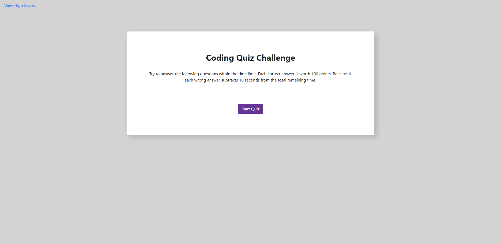

# Code-Quiz

## Introduction

Our task for this assignment was to build a timed code quiz with multiple-choice questions. The app is to run in the browser and feature dynamically updated HTML and CSS, powered by JavaScript code. The app will be responsive, ensuring that it adapts to multiple screen sizes and will also feature a clean and polished user interface. 

## Instructions

When the user clicks the start quiz button the timer will start and they will be presented with a series questions. If the user answers a question incorrectly, 10 seconds will be subtracted from the clock. When all question have been answered, or the timer runs out, the quiz ends. When the quiz ends the user may save their initials and score.  

## Technologies

* HTML
* CSS
* JavaScript
* JQuery

## Deployed

[GitHub Repo](https://github.com/bosshogg86/code-quiz)

[Code-Quiz](https://bosshogg86.github.io/code-quiz/)

